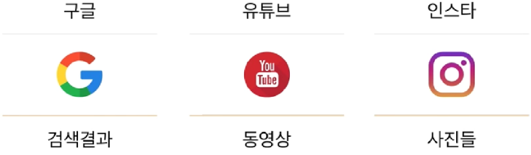

# Web

~~!~~

## Web Service

~!~

### 서비스?

~!~

**무언가**를 **제공** 하는 것

~!~

### 웹 서비스
 

**웹**(_**W**orld **W**ide **W**eb_)을 통해 
 
**무언가**를 
 
**제공**하는 것

Note:
말은 간단하죠?

~!~

#### 각 사이트가 제공하는 것

~~!~~

## Service

~!~

무언가를 **서비스**에 
 
 
**요청**하고(Request)
 
**→**
 
**받는**다(Response)

~!~

### Caffe

 

**주문서**를 통해 **카페 주인**에게
 
 
**아메리카노**를 **주문**(요청)하고 
 
 
카페 주인은 주문서대로
 
 
**아메리카노**를 **제공**(응답)한다

~!~

### Google

 

**검색어**로 **구글**에게
 
 
**검색**을 **요청**하고 
 
 
구글은 검색어대로
 
 
**검색 결과**를 **응답**한다

~!~

### Google

 

**URL**로 **구글**에게
 
 
**검색**을 **요청**하고 
 
 
구글은 URL대로
 
 
**검색 결과**를 **응답**한다

~~!~~

## WebService

~!~

주소창을 통해 요청한다

~!~

URL = 주문서

~!~

### URL(주문서)

 

<table>
  <tr>
      <th>누가</th>
      <th>어떻게</th>
      <th>무엇을</th>
  </tr>
  <tr>
      <td>google.com</td>
      <td>/search</td>
      <td>?q=</td>
  </tr>
  <tr>
      <td>search.naver.com</td>
      <td>/search.naver</td>
      <td>?query=</td>
  </tr>
  <tr>
      <td>instagram.com</td>
      <td>/</td>
      <td></td>
  </tr>
</table>

Note:
다른 사이트 (네이버, 인스타그램) 보여주기

~!~

우리도 서비스를 만들 때 URL 구조를 짜게 된다.

~~!~~

## HTML

~!~

웹 서비스는
 
**한 장의 문서 파일**만
 
제공

Note:
그것이 html!
예시 보여주기

~!~

**.html**로 끝나는 파일

~!~

**H**yper **T**ext **M**arkup **L**anguage

~!~

### Hyper Text

참조(하이퍼 링크, 위치)로 이루어진

Note:
동영상, 이미지, 다음 페이지의 위치

~!~

### Makrup Language

마크업 언어
 
태그를 이용하여 문서의 구조를 표현

Note:
ORM 마크 하듯이
표시하다
head, body인 것을 표시하겠다

~~!~~
